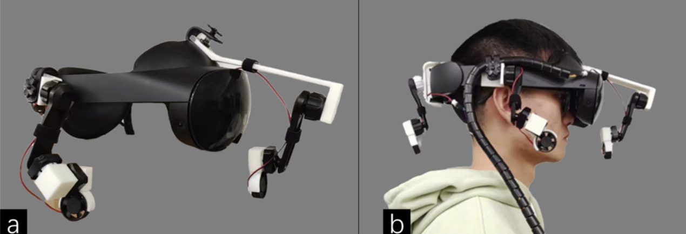

I am Fangtao Zhao (赵方韬), a postgraduate student at Viterbi School of Engineering, University of Southern California (USC). I am also a Research Assistant in [USC HaRVI Lab](https://sites.usc.edu/culbertson/), under the supervision of [Heather Culbertson](https://viterbi.usc.edu/directory/faculty/Culbertson/Heather). 

I completed my BSc degree at Xi’an Jiaotong-Liverpool University (XJTLU) in 2023 and was a member of X-CHI Lab, directed by [Hai-Ning Liang](https://scholar.google.com/citations?user=UJPH5ioAAAAJ&hl=en). I was a Research Assistant at [Computation Media and Arts (CMA)](https://cma.hkust-gz.edu.cn/), Hong Kong University of Science and Technology (Guangzhou) (HKUST-GZ) in 2024, directed by [Mingming Fan](https://www.mingmingfan.com/).

In addition to being a researcher, I am also a game developer and a member of [USC Games](https://games.usc.edu). Currently, I am working as the Audio Lead for a USC Advanced Games Project (AGP). See you at the [USC Games Expo](https://www.uscgamesexpo.com) 2025!

You can find my [CV](../files/Fangtao_ZHAO_CV_2024.9.19.pdf) here.

Email: fangtaoz@usc.edu

About My Research
-
My research interests lie in the realm of Human-Computer Interaction (HCI), specifically in Virtual Reality (VR), Haptics, Multimodal Interfaces, and Games. My work focuses on studying the way users perceive the environment under different conditions and developing interactive systems that match their perceptual characteristics. 

Publications
-
<table style="border: none; font-size: inherit;">
  <tr>
    <td>
      <strong>AirWhisper: Enhancing Virtual Reality Experience via Visual-Airflow Multimodal Feedback</strong> 
      <strong>Fangtao Zhao</strong>, Yiming Luo, Ziming Li, Yue Li, Hai-Ning Liang 
      <em>Journal on Multimodal User Interface. JMUI 2024</em> 
      <a href="../files/AirWhisper.pdf">[PDF]</a>
    </td>
    <td>
      
    </td>
  </tr>
</table>

<!--
**AirWhisper: Enhancing Virtual Reality Experience via Visual-Airflow Multimodal Feedback**  
**Fangtao Zhao**, Yiming Luo, Ziming Li, Yue Li, Hai-Ning Liang  
*Journal on Multimodal User Interface. JMUI 2024*
[[PDF](../files/AirWhisper.pdf)]
-->
